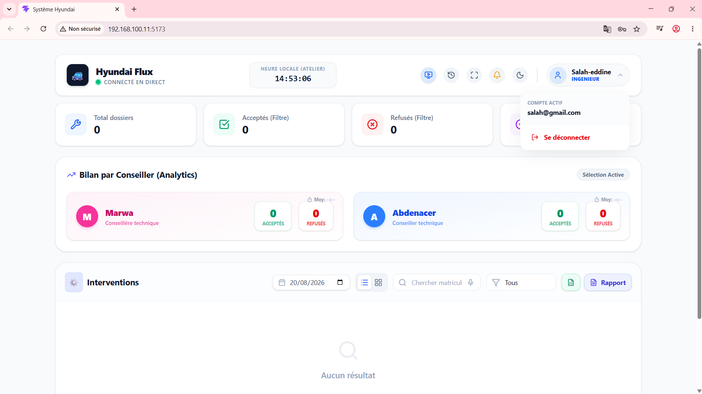
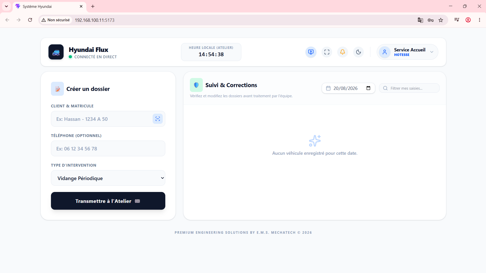

<div align="center">

# 🚗 Hyundai Flux - Full Stack Enterprise System

A robust, enterprise-grade Full-Stack application designed to streamline workflows, manage vehicle operations, and display real-time statuses with modern UI/UX.


</div>

---

### 🌟 Key Features

*   🔄 **Dual-Architecture Setup:** Fully decoupled frontend (`hyundai-frontend`) and backend (`hyundai-backend`) for maximum scalability.
*   ⚡ **One-Click Startup:** Includes a customized automation batch script (`Lancer_Hyundai.bat`) to fire up both servers simultaneously.
*   🎨 **Sleek Interface:** Modern Dashboard styled with Tailwind CSS, supporting interactive status cards, dynamic timelines, and fluid animations.
*   🔒 **Secure Operations:** Optimized backend APIs for secure request handling and reliable data integration.

---

## 📸 Project Visuals

### Hyundai Flux Dashboard


---

### System Interface & Operations



### 📂 Directory Structure

```text
├── hyundai-frontend/     # React + Vite frontend application
├── hyundai-backend/      # Node.js + Express backend server
└── Lancer_Hyundai.bat    # Automation script to launch the full-stack system
